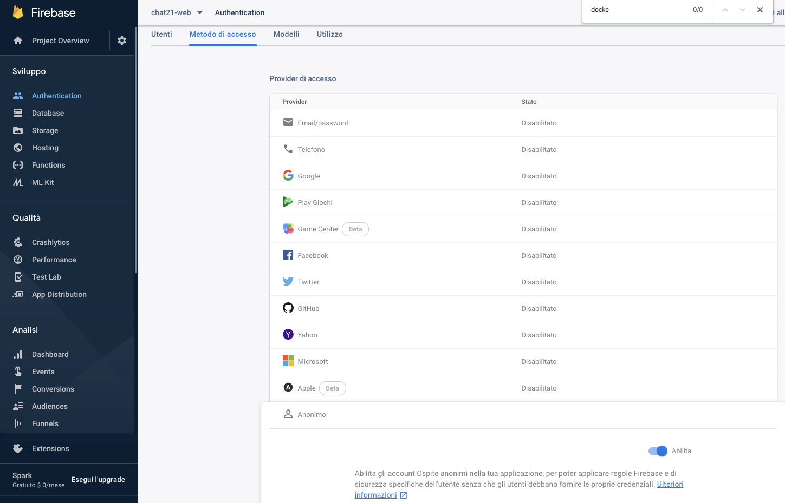

# Dialogflow as external chatbot integration

## Introduction

Integrating Dialogflow agents to Tiledesk offers many advantages, first of all the possibility to handoff current chatbot's conversation to humans. This is a very common task in chatbot integration design, because a chatbot cannot always satisfy every user request or simply because the first chatbot was there just to welcome the user, get the user question, choose the right team and then forward the request to the selected team.

We just created this first toturial to allow a more customized integration experience with Dialogflow, allowing you to understand how easy is to attach an external chatbot, Dialogflow in this case, to Tiledesk and switch conversation to humans when needed.

We'll use [Heroku](https://www.heroku.com/) and [Github](https://github.com/) to crete our first integration project.

## Fork the tutorial code

The tutorial code is already available on Github [here](https://github.com/Tiledesk/tiledesk-dialogflow-proxy-tutorial).

Fork the tutorial code on your favourite repo using the Fork button. Now you have a copy of the tutorial on your own repo.

## Create the Heroku app

If you don't have a Heroku account please create one. Once you created your account you will move to the application's dashboard [here](https://dashboard.heroku.com/apps).

In the top right corner menù of the Heroku Dashboard press _New_ &gt; _Create new app_ option:

Now choose a name for your application. You can choose whatever name you prefer, but **my-tiledesk-proxy** will not be obiviously available 🙂

Leave all other settings as default and finally push the _Create app_ button.

## Connect Heroku app to your Github repo

Now in the "Deployment method" section select Github \(image label: 1\). In the "Connect to Github" form insert the exact name of the repo you just forked, that is "tiledesk-dialogflow-proxy-tutorial" and press Search \(image label: 2\). If everything is correct heroku will show your repo just below the search filed. Press "Connect" \(image label: 3\).

Now that your Heroku's app is connected to Github you can enable automatic deploys, so Heroku will restart your app every time you push new code on the repo.

 

In this tutorial we suppose you already set up a Dialogflow agent and you already have the credentials file. If you do not have the Google Credentials file please refer to this [tutorial](generate-dialgoflow-google-credentials-file.md).

