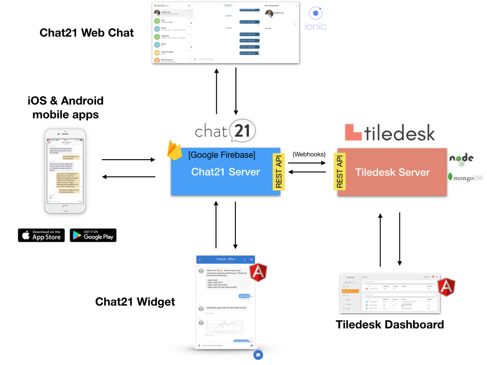

# Architecture overview

## Modules overview

[Chat21](http://www.chat21.org) is a messaging engine with a multi platform SDKs: native iOS and Android mobile SDKs and Web SDKs.

Widget, Web Chat and Native mobile apps are Chat21 modules. Chat21 relies on Google [Firebase](http://firebase.google.com/) as the backend database.

Chat21 communicates with Tiledesk through webhooks. When a Chat21 event occurs - a new message arrives, a new member join a group, etc - a new Event is created and notified to Tiledesk Server. Chat21 then makes an HTTP POST request to send the Event to the Tiledesk webhook [endpoint](https://github.com/Tiledesk/tiledesk-server/blob/master/channels/chat21/chat21WebHook.js) .

## Components overview

### Components list

#### Core

* [Tiledesk Server](https://github.com/Tiledesk/tiledesk-server) 
* [Chat21 Cloud Functions](https://github.com/chat21/chat21-cloud-functions)
* [Tiledesk Dashboard](https://github.com/Tiledesk/tiledesk-dashboard)

#### Clients

* [Chat21 Web Widget](https://github.com/chat21/chat21-web-widget)
* [Chat21 Ionic Web App](https://github.com/chat21/chat21-ionic)

#### Mobile apps

* [Tiledesk Android app](https://github.com/Tiledesk/tiledesk-android)
* [Tiledesk iOS app](https://github.com/Tiledesk/tiledesk-ios-app)

#### Mobile SDKs

* [Android SDK](https://github.com/Tiledesk/tiledesk-android-sdk)
* [iOS SDK](https://github.com/Tiledesk/tiledesk-ios-sdk)

#### GitHub Projects Pages

* [Tiledesk project](https://github.com/tiledesk)
* [Chat21 project](https://github.com/chat21)

