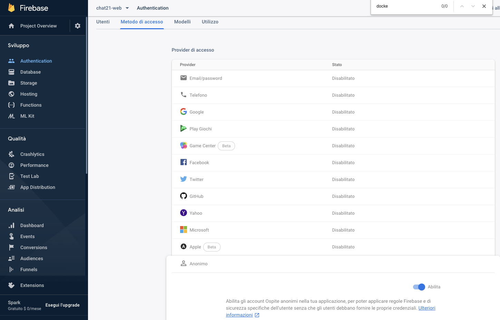

# Open the ports

Tiledesk docker installation requires the following ports to be open:

* 80: Ngix service
* 3000: tiledesk service
* 4040: Ngrok service
* 4200: Web Widget service
* 9005: Firebase CLI service
* 5000: Firebase CLI service 
* 8080: Web Ionic service
* 4500: Tiledesk Dashboard

