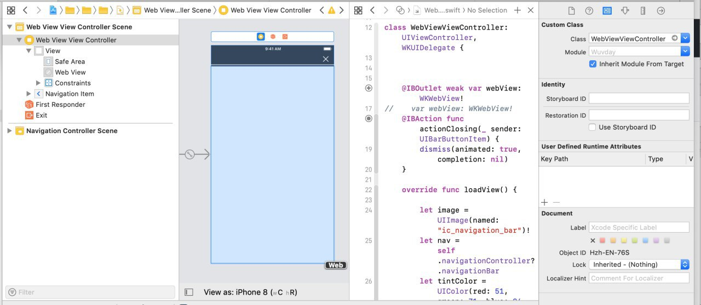

# Integrate Widget for iOS with WKWebView

## Controller

```text
//
//  WebViewViewController.swift
//  Tiledesk
//
//  Created by Dario De Pascalis on 03/04/2019.
//  Copyright © 2019 tiledesk. All rights reserved.
//

import UIKit
import WebKit

class WebViewViewController: UIViewController, WKUIDelegate {
 
    @IBOutlet weak var webView: WKWebView!
    @IBAction func actionClosing(_ sender: UIBarButtonItem) {
        dismiss(animated: true, completion: nil)
    }
    
    override func loadView() {
        
        let image = UIImage(named: "ic_navigation_bar")!
        let nav = self.navigationController?.navigationBar
        let tintColor = UIColor(red: 51, green: 71, blue: 94, alpha: 1)
        nav?.setupNavigationBar(barStyleBlack: true, tintColor: tintColor, image: image)
        
        
        let webConfiguration = WKWebViewConfiguration()
        webView = WKWebView(frame: .zero, configuration: webConfiguration)
        webView.uiDelegate = self
        view = webView
    }
    
    
    
    override func viewDidLoad() {
        super.viewDidLoad()
        let url = "https://widget.tiledesk.com/v2/index.html?tiledesk_projectid=<CHANGE_IT>&tiledesk_isopen=true&tiledesk_fullscreenMode=true&tiledesk_hideHeaderCloseButton=true"
        let myURL = URL(string:url)
        let myRequest = URLRequest(url: myURL!)
        webView.load(myRequest)
    }
    

    /*
    // MARK: - Navigation

    // In a storyboard-based application, you will often want to do a little preparation before navigation
    override func prepare(for segue: UIStoryboardSegue, sender: Any?) {
        // Get the new view controller using segue.destination.
        // Pass the selected object to the new view controller.
    }
    */

}

```

## Web View Controller

Create a Web View Controller in your Story Board and add a WebView as below:



